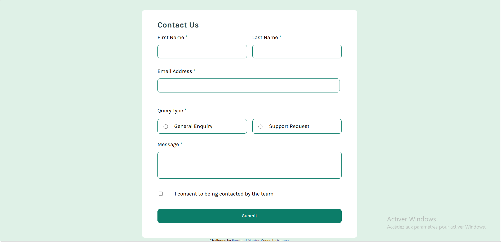

# Frontend Mentor -Contact Form Solution

This is a solution to the [Contact Form Challenge on Frontend Mentor](https://www.frontendmentor.io/challenges/contact-form--G-hYlqKJj). Frontend Mentor challenges help you improve your coding skills by building realistic projects. 

## Table of contents

-[Preview](#preview)
  -[The challenge](#the-challenge)
  -[Screenshot](#screenshot)
  -[Links](#links)
-[My process](#my-process)
-[Built with](#built-with)
-[What I learned](#what I learned)
  -[Continued development](#continued-development)
  -[Useful resources](#useful-resources)
  -[AI collaboration](#ai-collaboration)
-[Author](#author)
-[Acknowledgments](#acknowledgements)

## Overview

### The challenge

The challenge is to create a form with the following constraints:
-The user must correctly fill in all form fields
-If a single field is not completed, the page will return an error message
-Once all fields are filled, the page will send a success message
Of course the form is also responsive so that it adapts and displays correctly depending on the device.

### Screenshot



### Links

-Solution URL: [Add solution URL here](https://your-solution-url.com)
-Live Site URL: [Add Live Site URL Here](https://your-live-site-url.com)

## My process

### Built with

-HTML5 semantic markup
-CSS variables
-CSS Flexbox
-CSS Grid
-Media queries for responsiveness
-Organization of JavaScript code

### What I learned
In this project, I learned and mastered the concept of regular expressions, real-time validation of forms and of course the discovery of a new concept (parentElement)
Voici quelques exemples:

-Expressons régulières:

```js
const regexEmail = /^[a-zA-Z0-9._%+\-]+@gmail\.com$/;
if(email.value === ""){
  displayError(email , errorEmail);
}
else{
  if(regexEmail.test(email.value)){
    displayValidation(email);
  }
  else{
    displayInvalidation(email);
  }
}
```
```js
function displayError(valueError , elementError){
  valueError.style.border = "1px solid hsl(0, 66% , 54%)";
  elementError.classList.add('showError');
  setTimeout(() => {
elementError.classList.remove('showError');
  } , 3000);
}
```

### Continuous development

In future projects, I will focus a little more on advanced JavaScript concepts and the use of MVC architecture for good code organization

### Useful resources

-[MDN Web Docs](https://developer.mozilla.org/en-US/) -This is my main resource for learning each new concept. It's very complete and I will use it a lot in the future
-[W3 Schools](https://www.w3schools.com/) -This is my second resource to quickly learn every concept that I don't understand well yet, I will also use it in the future with MDN Web Docs

### AI collaboration

I collaborated with the AIs in the following way:

-I used Chatgpt and Claude in this project
-I used them to review the code I created and give me an improvement in return if there is any

## Author

-Website -[Harena](https://github.com/Harena-debug)
-Mentor Frontend -[@Harena-debug](https://www.frontendmentor.io/profile/Harena-debug)

## Remerciements

Thank you really to Frontend Mentor for offering me this challenge even if it wasn't easy, thank you also to the AI ​​for helping me during this journey, thank you also to the Lord for supporting me during this project.